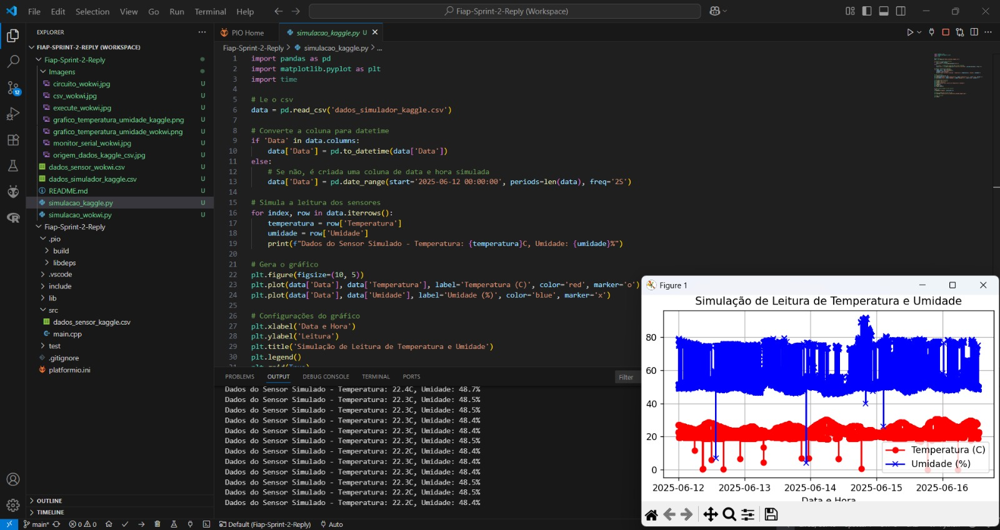

# Projeto: Coleta de Dados com ESP32 e Sensores Virtuais

## Integrantes
- Luis Fernando dos Santos Costa - rm565285
- Lucas Medeiros Leite - rm564892
- Richard Seberino Marques - rm563313
- Évelyn Zenira Rodrigues de Araujo - rm562451
- Douglas de Souza Felipe - rm561335

## Descrição
Simulação de coleta de dados de temperatura e umidade usando ESP32 no Wokwi, com análise dos dados em Python. Também foi utilizada uma base de dados real do Kaggle para comparação e análise, simulando um ambiente industrial digitalizado.

## Sensores Utilizados
- **DHT22 (Temperatura e Umidade)**
  - O sensor DHT22 mede temperatura e umidade, variáveis importantes em ambientes industriais, pois afetam diretamente o funcionamento das máquinas e a qualidade do ambiente. Além disso, é comumente utilizado na indústria, possui alta precisão e é compatível com simuladores como o Wokwi.

## Fontes de Dados
- **Simulação Wokwi:** Dados coletados do sensor virtual no simulador Wokwi.
- **Kaggle:** Dados reais do dataset ["Environmental Sensor Data"](https://www.kaggle.com/datasets/garystafford/environmental-sensor-data-132k), filtrados para temperatura e umidade.

## Esquema do Circuito


## Link da Simulação no Wokwi
[Simulação no Wokwi](https://wokwi.com/projects/433630495917094913)

## Códigos Utilizados

### ESP32 (Wokwi)
Trecho representativo:
```cpp
void loop() {
  float temp1 = dht1.readTemperature();
  float hum1 = dht1.readHumidity();
  float temp2 = dht2.readTemperature();
  float hum2 = dht2.readHumidity();

  Serial.println("Sensor 1:");
  Serial.print("Temperatura: ");
  Serial.print(temp1);
  Serial.print(" C  |  Umidade: ");
  Serial.print(hum1);
  Serial.println(" %");

  Serial.println("Sensor 2:");
  Serial.print("Temperatura: ");
  Serial.print(temp2);
  Serial.print(" C  |  Umidade: ");
  Serial.print(hum2);
  Serial.println(" %");

  Serial.println("-------------------------");
  delay(3000);
}
```
[Código completo do ESP32 (main.cpp)](src/main.cpp)

### Análise dos Dados do Wokwi (Python)
Trecho representativo:
```python
import pandas as pd
import matplotlib.pyplot as plt

df = pd.read_csv('dados_sensor_wokwi.csv')
plt.plot(df['Tempo'], df['Temperatura'], label='Temperatura (°C)')
plt.plot(df['Tempo'], df['Umidade'], label='Umidade (%)')
plt.legend()
plt.savefig('Imagens/grafico_temperatura_umidade_wokwi.png')
```
[Código completo da análise Wokwi (analise_wokwi.py)](analise_wokwi.py)

### Análise dos Dados do Kaggle (Python)
Trecho representativo:
```python
import pandas as pd
import matplotlib.pyplot as plt

df = pd.read_csv('dados_simulador_kaggle.csv')
plt.plot(df['Tempo'], df['Temperatura'], label='Temperatura (°C)')
plt.plot(df['Tempo'], df['Umidade'], label='Umidade (%)')
plt.legend()
plt.savefig('Imagens/grafico_temperatura_umidade_kaggle.png')
```
[Código completo da análise Kaggle (analise_kaggle.py)](analise_kaggle.py)

## Coleta de Dados

### Como os dados CSV foram gerados
As leituras exibidas no terminal do Wokwi foram copiadas manualmente e salvas em um arquivo CSV (`dados_sensor_wokwi.csv`), estruturado para leitura em Python. Os dados do Kaggle foram baixados, filtrados para conter apenas temperatura e umidade, e salvos em `dados_simulador_kaggle.csv`.

### Prints
- **Print do Monitor Serial (Wokwi):**
  
- **Print do arquivo CSV gerado:**
  
- **Print da execução Wokwi:**
  
  - **Print do script Python com dados do Wokwi rodando:**
  
- **Print do arquivo de dados do Kaggle:**
  
  - **Print do script Python com dados do Kaggle rodando:**
  

## Análise dos Dados

### Gráficos gerados a partir dos dados do Wokwi


### Gráficos gerados a partir dos dados do Kaggle


## Como rodar a análise

1. Instale o Python 3.x em seu computador.
2. Instale as bibliotecas necessárias com o comando:
   ```
   pip install pandas matplotlib
   ```
3. Execute o script `analise_wokwi.py` para gerar os gráficos do Wokwi.
4. Execute o script `analise_kaggle.py` para gerar os gráficos do Kaggle.
5. Os gráficos serão salvos automaticamente na pasta `Imagens`.

## Tecnologias Utilizadas
- ESP32 (simulado)
- Sensor DHT22 (simulado)
- Wokwi (simulador online)
- PlatformIO + VS Code
- Python 3.x
- Bibliotecas Python: pandas, matplotlib

## Prints e Evidências
- Print do circuito montado no Wokwi
- Print do Monitor Serial mostrando leituras
- Print do arquivo CSV aberto
- Print dos gráficos gerados
- Print do script Python rodando no terminal

## Conclusão
O projeto permitiu simular um ambiente industrial digitalizado, coletando e analisando dados de sensores virtuais e reais. A análise dos dados demonstrou a importância de dados reais para análises mais robustas e para o desenvolvimento de soluções de monitoramento inteligente.

---